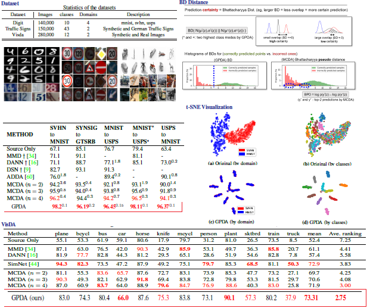

**This is the project page for Unsupervised Visual Domain Adaptation:A Deep Max-Margin Gaussian Process Approach.
The work was accepted by CVPR 2019 Oral.**
[[Paper Link(arxiv)]](https://arxiv.org/pdf/1902.08727.pdf).
<br>

## Abstract
In unsupervised domain adaptation, it is widely known that the target domain error can be provably reduced by having
a shared input representation that makes the source and target domains indistinguishable from each other. Very recently it
has been studied that not just matching the marginal input distributions, but the alignment of output (class) distributions is
also critical. The latter can be achieved by minimizing the maximum discrepancy of predictors (classifiers). In this paper,
we adopt this principle, but propose a more systematic and effective way to achieve hypothesis consistency via Gaussian
processes (GP). The GP allows us to define/induce a hypothesis space of the classifiers from the posterior distribution of the
latent random functions, turning the learning into a simple large-margin posterior separation problem, far easier to solve
than previous approaches based on adversarial minimax optimization. We formulate a learning objective that effectively
pushes the posterior to minimize the maximum discrepancy. This is further shown to be equivalent to maximizing margins
and minimizing uncertainty of the class predictions in the target domain, a well-established principle in classical (semi-
)supervised learning. Empirical results demonstrate that our approach is comparable or superior to the existing methods on
several benchmark domain adaptation datasets.

![method.pdf]
<br>

## Results

<br>

## Codes
[[Classification]](https://github.com/seqam-lab/GPDA/tree/master/src) 

## Citation
If you use this code for your research, please cite our papers (This will be updated when cvpr paper is publicized).
```
@article{kim2019unsupervised,
  title={Unsupervised Visual Domain Adaptation: A Deep Max-Margin Gaussian Process Approach},
  author={Kim, Minyoung and Sahu, Pritish and Gholami, Behnam and Pavlovic, Vladimir},
  journal={arXiv preprint arXiv:1902.08727},
  year={2019}
}
```
